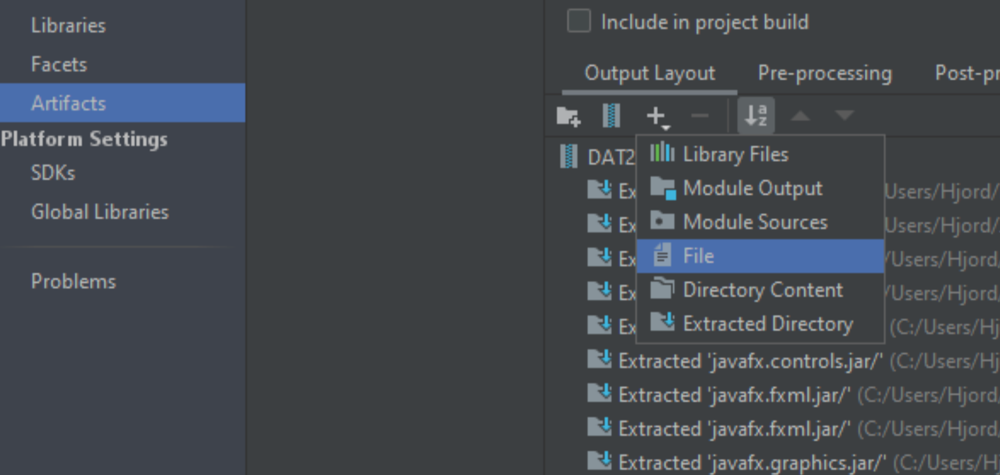

# Deployment/release/udgivelses plan 

 

### Forudsætninger for at kunne køre programmet
1. Java 15 eller nyere.
2. Mac brugere skal have tilladt at hente programmer fra ukendte udviklere.

 

## Oprettelse af jar filen
 
1. Der skal laves en klasse der kalder Main klassen

 

2. Tryk på File --> Project Structure --> Artifacts

 

3. Tryk på plus-ikonet og vælg JAR --> From modules with dependencies...

 

4. Opret en ny main klasse (Denne klasse skal kalde den anden main klasse)

 

5. Der skal nu tilføjes en javaFX bin folder. Dette gøres ved at trykke på det lille plus og herefter vælges filer

 

6. Alt fra JavaFX bin folderen vælges

 

7. Tryk på Apply og Okay

 

8. Nu kan du bygge programmet ved at trykke på Build og vælge Build Artifacts

 

9. En pop-up menue kommer frem og der vælges build.   
10. Den færdige jar fil er nu klar til deployment og kan åbnes uden nogle ekstra programmer
