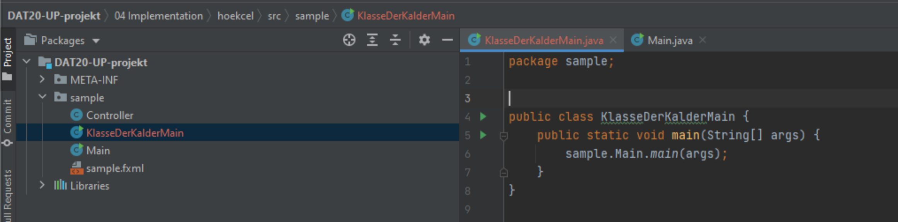

# Deployment/release/udgivelses plan 

 

### Forudsætninger for at kunne køre programmet
1. Java 15 eller nyere.
2. Mac brugere skal have tilladt at hente programmer fra ukendte udviklere.

 

## Oprettelse af jar fil
 
1. Der skal laves en klasse der kalder Main klassen

