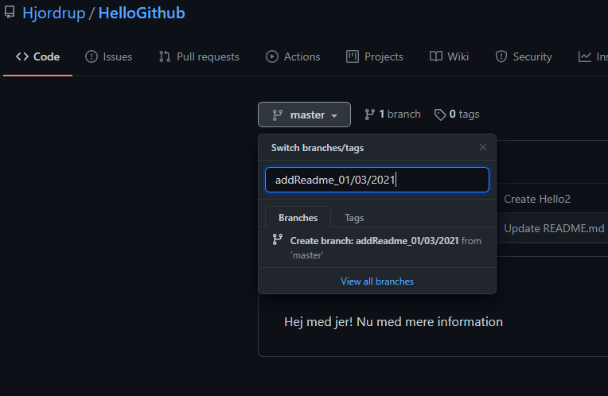
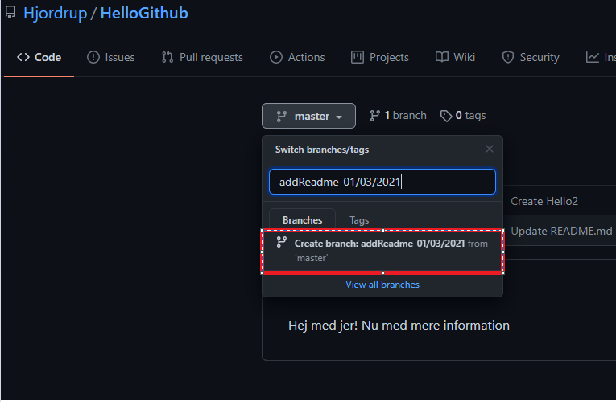
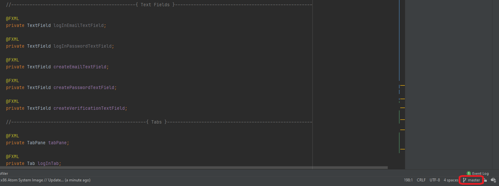
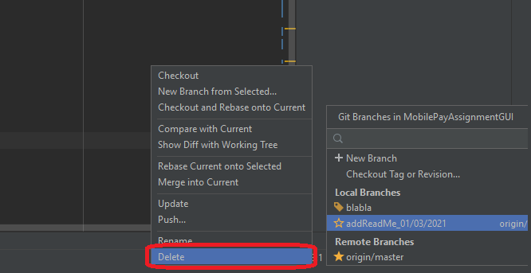

# Branching procedure for HØK Projekt:

**WorkFlow:**

1. Lav en ny Branch med et godt navn. ved at bruge Regler for gode navne
2. Når en feature er færdig og klar til at blive merge, skal merge processen udføres.
3. Når en feature er blevet merged skal branchen fjernes.

**Regler for gode navne**

Navngiv branchen efter issue titlen.
Et eksempel på dette kan ses nedenfor:
issueNavn

_Brug camelCase_

**Skab ny branch gennem Github.com: Se billeder under.**

1. Åben repository
2. Tryk på Master Branch knappen.

   

3. Giv branchen et meningsfuldt navn. Følg Regler for gode navne.

   

4. Tryk på “Create” Knappen.

   

<br>

**Lav Branch gennem Git (command line)**

Start tomt repository:

```cmd
git init
```

Tilføj remote:

```cmd
git remote add origin YOUR_REPO_URL_HERE.git
```

Træk ændringer fra master branchen:

```cmd
git pull origin master
```

Lav ny branch:

```cmd
git checkout -b [branch_name]
```

Skift til en eksisterende branch:

```cmd
git checkout [branch_name]
```

Tilføj ændringer:

```cmd
git add .
```

Commit ændringer:

```cmd
git commit -m “your_message”
```

Push til branch:

```cmd
git push origin [branch_name]
```

**Slet Branch gennem Github.com.**

1. Tryk på branch knappe.
2. Find den branch du gerne vil slette efter review.
3. Tryk på slet ikonet ud for branch navnet.

**Slet Branch gennem IntelliJ**

1. Klip på branch knappen.

   

2. Find feature branchen som skal slettes. og klik på delete.


