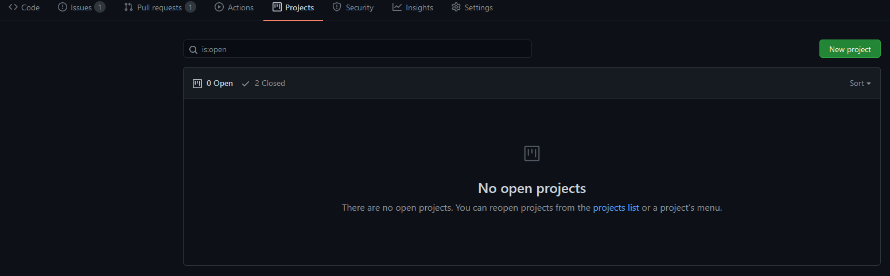
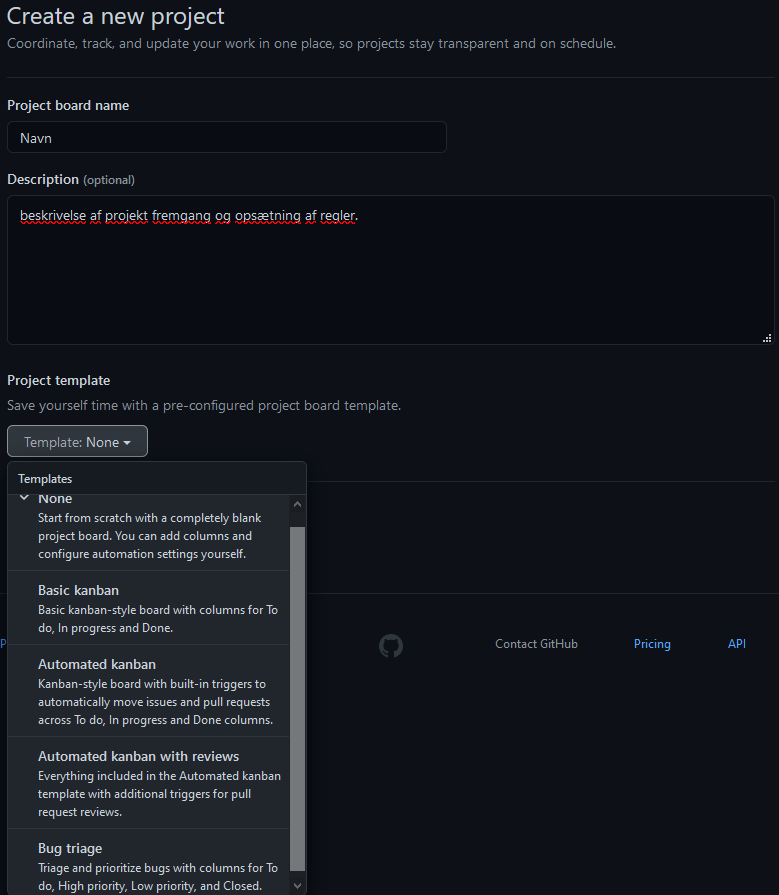
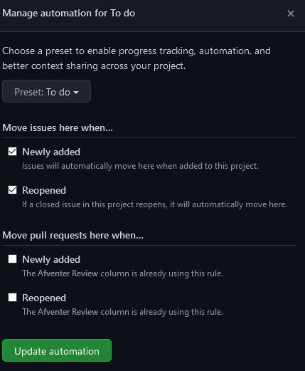
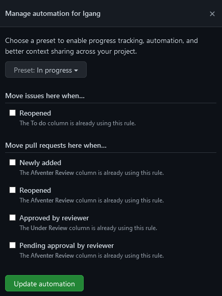
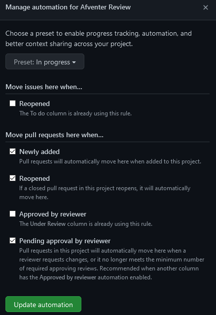
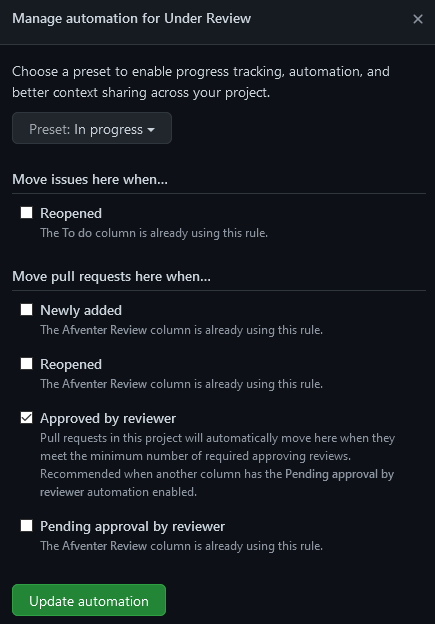
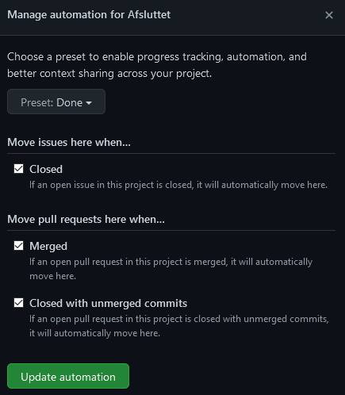

# Skabelon til oprettelse af Github project med iterative process

**Oprettelse:**
Du kan oprette dit project direkte I det github repository som dit project tilhører.

I fanebladene som ligger under projekt navn og organization er der en fane kaldet “projects”, ved at klikke på denne får man overblik over åbne og lukkede projekter til repoet. For at oprette et nyt trykkes der på “New project” over oversigts vinduet.

 billede eksempler

  
  

Efter du har valgt “new project” skal du give projektet et navn, regler for håndtering af kolonner og evt. En beskrivelse. “Templates” er de regler som vi giver til projektet og vi kommer til at bruge “Automated Kanban with reviews”.

 billede eksempler

  
 

Hver template har en forklaring på hvad de gør. Hvis ingen template vælges bliver et projekt uden kolonner og automatiserede functioner oprettet.

**Tilrettelse af kolonner:**

_Som udgangspunkt vil “Kanban with Automated reviews” lave 4 kolonner._

- To do

- Assigned

- Reviews

- Done

**I vores project bruger vi:**

- To do

- Igang

- Afventer review

- Under review

- Afsluttet

Hvis det klikkes på manage knappen nederst I en kolonne kan redigere reglerne for den kolonne.
OBS. 2 kolonner kan ikke have de same regler krydset af.
Presets er skabelonen for de regler er tilhører og uden preset har en kolonne ingen regler.

- Vores To Do skal have preset To Do:
  - (issues)Newly added, (issues)reopened
    Krydset af.

 billede eksempler

  
   
  

- Vores Igang skal have preset in progress men intet krydset af.

 billede eksempler

  
   
  

- Vores Afventer review skal have preset in progress:
  - (pullrequest) Newly added (pullrequest) reopened (pullrequest) pending approval by reviewer krydset af.

 billede eksempler

  
   

- Vores Under review skal have preset in progress:
  - (pullrequest) Approved by reviewer krydset af.

 billede eksempler

  
   
 

- Vores Afsluttet skal have preset Done, med alt krydset af

 billede eksempler

  
   

