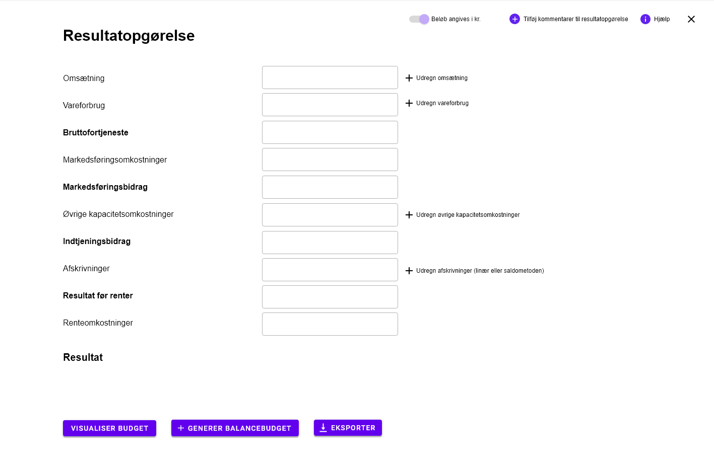
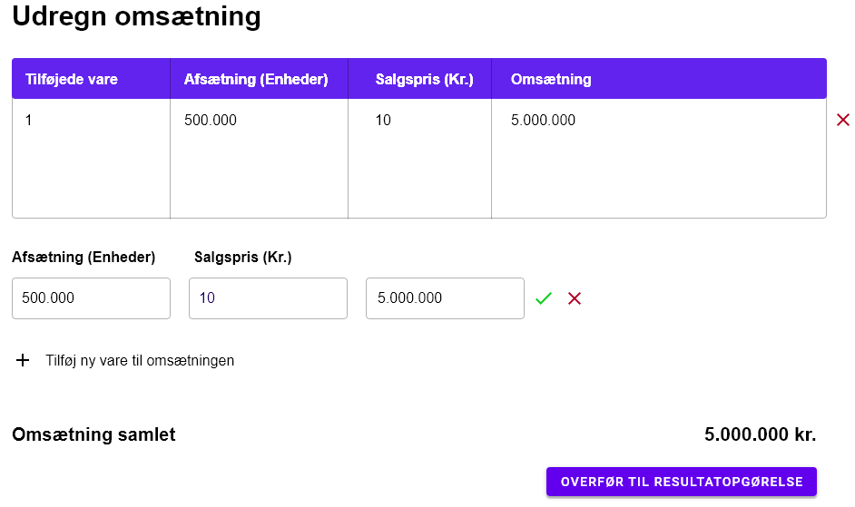
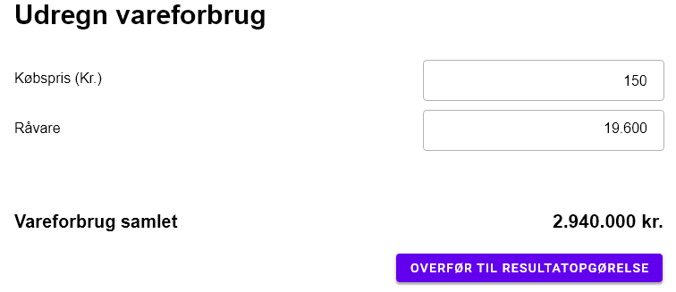
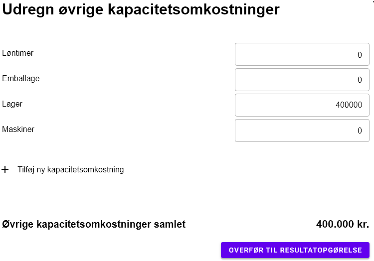
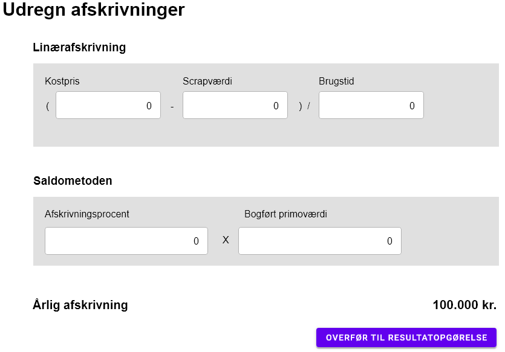

# DAT20-UP-projekt

# Fælles projekt for os datamatiker på dette 3 ugers projekt.
Projektet formår, at nemmeliggøre fremtidige og nuværende økonomers arbejde i forhold til at kunne udregne specifikke værdier på effektiv vis. Ofte set er udregningen et tidskrævende arbejde, men det endelige program vil kunne hurtiggøre arbejdet i fremtiden. 

Til udviklere som er interesseret i produktet, forneden vil I se hvor alt information gemmer sig. 

01 Buisness Modeling
 

  
Indeholder artifakter der straks er relateret til virksomheds-aspektet:
  
- Vision document = VD
- FURPS+ = FURPS
- Use Case Model = UCM
- Analysis Model = AM
- Target- Organization Assessment = TOA
- Business Rules = BR
- Supplementary Business Specifications = SBS
- Business Glossary = BG
- Business Architecture Document = BAC
 

02 Requirements
 
 
  
Indeholder artifakter der straks er relateret til requirements:

- Use Cases = UC
- Use Case diagrammer = UCD
- Class diagrammer = CD   
- Aktivitets diagrammer = AD
- Domæne modeller = DM
- System diagrammer = SD
- System Sekvens diagrammer = SSD
- Requirements Management Plan = RMP

03 Design
 

  
Indeholder artifakter der straks er relateret til designet af produktet:

- Class Diagrammer = CD
- Design Model = DEM
- Software Architecture Document = SAD 

04 Implementation
 

  
Alt som indebærer implementation af projektet. Det er afgrænset til kode-relateret arbejde:
- Model Mappe
- Persistence Mappe
- View Mappe

Filnavne i koden skal være på engelsk og skrives med camelCase.

05 Test
 

  
Indeholder artifakter der straks er relateret til test af produktet:
  
- Checklister til Review
- Test-kode (undermappe med navn test, hvor koden ligger henne) 
- Test-cases/TestData
- Test-Log
  

 

06 Deployment
 

  
Indeholder artifakter der straks er relateret til deployment af produktet: 
  
- .exe software 
- Installations artifakter : scripts, tools, filer, guides, licensing information 
- Udgivelses Noter, beskrivelse af release for slut brugeren
- Support Materiale, bruger manual
- Trænings Materiale

07 Configuration & CM
 

  
Indeholder artifakter der straks er relateret til Configuration & CM: 

- Configuration management plan
- Change requests 

08 Project Management
 

  
Alt som indebærer projektet. Det er blandt andet materiale som tidsregistrering, iterationsplaner, kundemøder og lignende:

- Iterationsplan(er) = IP
- Kundemøder = KM

 09 Environment 
 

Environment - denne mappe indebærer alt procedure-relateret materiale. Navngivningen er baseret på dens navn/formål, men yderligere information kan findes i den pågældende .md fil:

- Development case = DC

# Vejledning til programmet

 Bruger Interface 
 

  
  Her ses vores automatiserede ui, siden at programmet er lavet til at hjælpe med at udregne et resultat budget og
  derfor antager vi at brugeren har kendskab til de forskellige nøgle ord. nøgleord som er et skrevet i fed er
  selvudregnene, det betyder at så længe du angiver de forhændværende felter som ikke er i fed vil de fede blive udregnet og udfyldt automatisk.
  

 
  

 
 Ud for felterne "Omsætning", "vareforbrug", "øvrige kapacitets omkostninger" og "afskrivninger (linær eller saldometoden)" er der "+" tegn til at hjælpe med at    sætte disse værdier op på en mere detaljeret vis og til at lægge dem sammen inde i interfacen.
 
  

 Omsætning 
 

  
  Hvis det forkommer at man har flere omsætningskilder, så kan vores program facilitere en mere detaljeret opsætning, tilføj flere kilder, giv dem et navn, så sætter interfacen det pænt op og importere summen til den primære bruger interface.
  
  
  
  

  

  

 Vareforbrug 
 

  
  
  
  

  

  
  

 Øvrige kapacitets omkostninger 
 

  
I denne tab kan man udregne de øvrige kapacitetsomkostninger, man kan udregne det med forskellige ting, her ser vi at den består af løntimer, emballage, lager og maskiner, som der allerede står skrevet ind fordi de er standard, men hvis der er omkostninger der ikke står her kan man tilføje nye, og når du har indskrevet alle de omkosntninger der nu skulle være, så kan man klikke "Overfør til resultatopgørelse" for at den udregner og skriver det ind i resultatsopgørelsen.
  
  
  
  

  

  
  

 Afskrivninger (linær eller saldometoden) 
 

  
  
  
  

  

  

